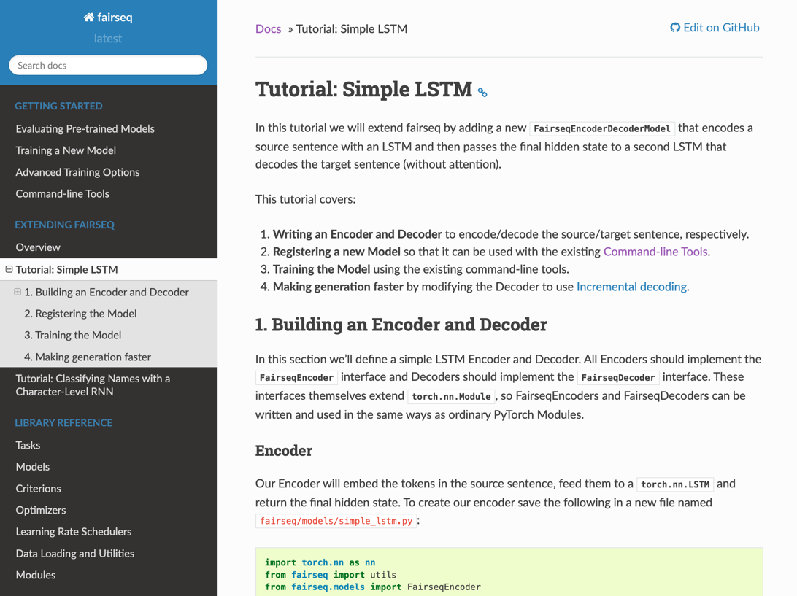

# Lesson-1-简单入门

依据阿拉伯数字到中文数字描述的转换，完成以下目标：

* fairseq translation的默认数据样式，能够进行预处理
* 知道model、architecture的含义
* 简单运行fairseq的相关流程
* 构建一个最简单的demo

## Step-1 看文档

看了一下fairseq的文档，前面GETTING STARTED部分感觉都是现成工具的运用，然而在我看来，还是需要结合代码，否则一直在门外，想改个啥想看log都难。
所以，我感觉第一步的边界应该是到看完实现LSTM 的seq2seq，参见 https://fairseq.readthedocs.io/en/latest/tutorial_simple_lstm.html


## Step-2 准备简单任务和数据

光说不练假把式，再怎么看文档终归是要落实到代码上的，而数据准备和任务的认识则是最开始的一步。

目标：

* 了解fairseq的translation任务的数据格式
* 能完成数据处理，便于后续步骤进行

鉴于正式任务的数据都比较难，收敛可能也会比较慢，不适合入门，我们在这一步自己造一个简单数据和任务。
任务目标很简单：将中文数字转化为阿拉伯数字。
为了造数据，我们使用cn2an这个包，脚本在prepare_data目录里。数据目录如下：

```
easy-dataset/raw_data
├── test.in
├── test.out
├── train.in
├── train.out
├── valid.in
└── valid.out
```

数据格式如下：

train.in

```
9 5 0 2 7 4
5 5 7 0 6 0
3 9 3 2 2 2
```

train.out

```
九 十 五 万 零 二 百 七 十 四
五 十 五 万 七 千 零 六 十
三 十 九 万 三 千 二 百 二 十 二
```

数据生成后，我们需要对数据进行预处理，预处理脚本见`step-2/step_2_preprocessing.sh`
完事儿后，目录长这样：

```
easy-dataset
├── preprocessed
│   ├── dict.in.txt
│   ├── dict.out.txt
│   ├── preprocess.log
│   ├── test.in-out.in.bin
│   ├── test.in-out.in.idx
│   ├── test.in-out.out.bin
│   ├── test.in-out.out.idx
│   ├── train.in-out.in.bin
│   ├── train.in-out.in.idx
│   ├── train.in-out.out.bin
│   ├── train.in-out.out.idx
│   ├── valid.in-out.in.bin
│   ├── valid.in-out.in.idx
│   ├── valid.in-out.out.bin
│   └── valid.in-out.out.idx
└── raw_data
    ├── test.in
    ├── test.out
    ├── train.in
    ├── train.out
    ├── valid.in
    └── valid.out
```

数据预处理的详细流程，参见
fairseq_cli/preprocess.py
可以`from fairseq_cli.preprocess import cli_main`来看

## Step-3 构造Encoder和Decoder

这一步基本上和之前连接中的一样，我们就不赘述了，不同的是，我们会将代码放到自己的项目里，之后通过fairseq的参数指定这个目录，这一点我们在后面再说

代码见`my_fairseq_module/models/simple_lstm_encoder.py`和`my_fairseq_module/models/simple_lstm_decoder.py`

需要稍微注意的是，这里我们的代码和fairseq tutorial的代码稍微有点不同，是修复了一个bug

## Step-4 注册model和architecture

model需要遵循FairseqEncoderDecoderModel的范式，主要看这个函数：

```python
@classmethod
def build_model(cls, args, task):
    encoder = SimpleLSTMEncoder(
        args=args,
        dictionary=task.source_dictionary,
        embed_dim=args.encoder_embed_dim,
        hidden_dim=args.encoder_hidden_dim,
        dropout=args.encoder_dropout,
    )
    decoder = SimpleLSTMDecoder(
        dictionary=task.target_dictionary,
        encoder_hidden_dim=args.encoder_hidden_dim,
        embed_dim=args.decoder_embed_dim,
        hidden_dim=args.decoder_hidden_dim,
        dropout=args.decoder_dropout,
    )
    model = SimpleLSTMModel(encoder, decoder)

    # Print the model architecture.
    print(model)

    return model
```

就是声明了一个encoder一个decoder，这里的参数啥的你也可以通过config传入，感觉更好一些，不过

注册通过装饰器完成：`@register_model('simple_lstm')`，
注册architecture也是装饰器：`@register_model_architecture('simple_lstm', 'tutorial_simple_lstm')`

这里理解一下model和architecture的区别：

* model定义了模型的结构，但是具体结构的参数没有写死，比如层数、维度、dropout的比例等等
* architecture则对这些没有写死的参数进行赋值
* 你要是想突破这些限制肯定没问题，不过最好遵循fairseq的范式
* 这里参考资料可以看fairseq 文档关于Model描述的第一段：
  > A Model defines the neural network’s forward() method and encapsulates all of the learnable parameters in the
  network.
  > Each model also provides a set of named architectures that define the precise network configuration (e.g., embedding
  > dimension, number of layers, etc.).

## Step-5 Train

这里最重要的是增加`--user-dir`参数，通过这个参数我们可以将我们定义的各种组件放进去

见`step-5-train.sh`

## Step-6 Evaluate

这里我们使用fairseq-generate的命令，直接在已经处理好的目录下进行predict，看一下结果

见`step-6-evaluate.sh`

## Step-7 原生Demo1

这里我们先使用fairseq-interactive的命令，进行交互式的输入输出

注意这里还没有tokenizer，所以咱们需要自己加上空格，比如`1 0 1 0 1 0`

见`step-7-demo.sh`

## Step-8 Python版demo

我们最终要向上线还是要借助python代码实现，这里我们直接借助GeneratorHubInterface的translate函数实现。
这个函数的具体细节代码中写的比较清晰，至少比checkpoint_utils.load_model_ensemble+tasks.setup_task(args)清晰。

运行代码之前，我们需要将bpe用到的字典和checkpoint放到一起

```
cp easy-dataset/preprocessed/dict.in.txt ./checkpoints
cp easy-dataset/preprocessed/dict.out.txt ./checkpoints
```

然后直接运行`python step-8-demo.py`

这次我们在代码中做了加空格的操作，所以会方便一些，这也从侧面验证了还是要落实到python代码上
