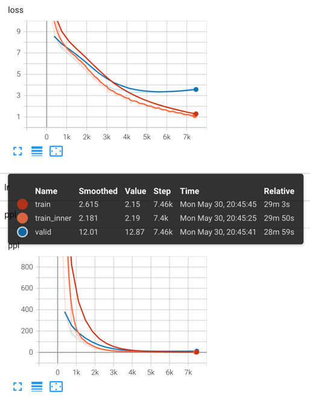

# Lesson-2-真·Transformer翻译

上一个练习里我们使用的是咱们自己造的数据，这里我们尝试用真实的翻译数据。

任务是英德的翻译，数据集来源是jiwei提供的一份比较小的MT数据集，其实已经是index好的，但也可以将每个index看做一个单词。

我们需要完成的是：

* 自定义task，能在task里load数据
* 用lesson2里定义的MyTransformerModel完成完成训练，并在valid上的ppl降低到20以下

## Step-0 下载数据

```
mkdir orig
cd orig
wget http://dl.fbaipublicfiles.com/fairseq/data/iwslt14/de-en.tgz
tar -zxvf de-en.tgz
cd ..
```

## Step-1 处理数据

我们把https://github.com/facebookresearch/fairseq/blob/main/examples/translation/prepare-iwslt14.sh这个拿了过来，
删除了tokenize、clean、bpe三个部分，因为我们想自己做tokenize和bpe

```bash
bash step-1-prepare-data.sh
```

到现在，你可以看到`iwslt14.tokenized.de-en/tmp`目录下有如下文件：

```
iwslt14.tokenized.de-en
└── tmp
    ├── IWSLT14.TED.dev2010.de-en.de
    ├── IWSLT14.TED.dev2010.de-en.en
    ├── IWSLT14.TED.tst2010.de-en.de
    ├── IWSLT14.TED.tst2010.de-en.en
    ├── IWSLT14.TED.tst2011.de-en.de
    ├── IWSLT14.TED.tst2011.de-en.en
    ├── IWSLT14.TED.tst2012.de-en.de
    ├── IWSLT14.TED.tst2012.de-en.en
    ├── IWSLT14.TEDX.dev2012.de-en.de
    ├── IWSLT14.TEDX.dev2012.de-en.en
    ├── test.de
    ├── test.en
    ├── train.de
    ├── train.en
    ├── train.en-de
    ├── train.tags.de-en.de
    ├── train.tags.de-en.en
    ├── valid.de
    └── valid.en
```

我们接下来要使用的是train.de, train.en, valid.de, valid.en, test.de, test.en

然后执行

```bash
mkdir -p iwslt14/raw iwslt14/tokenized iwslt14/bpe iwslt14/preprocessed
```

## Step-2 tokenize

确认是否安装了sacremoses

```bash
pip install sacremoses
```

```bash
python step-2-tokenize.py
```

生成的目录结构如下

```
iwslt14
├── raw
└── tokenized
    ├── test.json
    ├── train.for_bpe.src
    ├── train.for_bpe.tgt
    ├── train.json
    └── valid.json
```

这里要特别指出的是，鉴于第三方的fastbpe不是我们的重点，我们这里迁就一下，生成了两个特殊的文件——`train.for_bpe.src`和`train.for_bpe.tgt`，
目的是给fastbpe学习bpe，之后我们就可以利用学到的bpe来调用python接口了

## Step-3 bpe

这里解释一下bpe的概念

这里我们使用fastBPE作为bpe的手段

先下载fastbpe的代码：

https://github.com/glample/fastBPE

上传后按照fastBPE的readme编译，生成`fast`这个可执行文件

接着我们就可以调用这个可执行文件来进行bpe的学习（结果是生成一个codes.bpe）

```bash
./fastBPE/fast learnbpe 40000 iwslt14/tokenized/train.for_bpe.src iwslt14/tokenized/train.for_bpe.tgt > codes.bpe
```

这时候一个可能的报错是：
> /lib64/libstdc++.so.6: version `GLIBCXX_3.4.20' not found (required by ./fast)

这是动态链接库的问题，我们应该切换一下动态链接库，用当前虚拟环境中conda安装的。

首先，我们需要查看动态链接库

```
strings ~/anaconda3/envs/seq/lib/libstdc++.so | grep GLIBCXX.3.4.20
```

这里需要将`~/anaconda3/envs/seq`替换为你自己的虚拟环境路径，如果能正常找到，那么我们进行下一步（不能找到那就查一下其他方法吧）。

然后我们打开你的shell的配置，比如如果你用bash，那就是`~/.bashrc`，如果你用zsh，那就是`~/.zshrc`。然后添加这一行：

```
export LD_LIBRARY_PATH="/home/sunxiaofei/anaconda3/envs/seq/lib:$LD_LIBRARY_PATH"
```

还是需要将`/home/sunxiaofei/anaconda3/envs/seq`替换为你的虚拟环境路径。

最后一步是`source ~/.zshrc`或者`source~/.bashrc`，然后重新进入虚拟环境。

假设fastbpe运行成功了，那这个时候我们去看codes.bpe会看到类似于这样：

```
e n</w> 472306
i n 356571
e r 356146
t h 347206
c h 265455
e r</w> 257042
a n 238624
e n 217042
u n 186285
```

然后需要将bpe apply到train上

```bash
./fastBPE/fast applybpe train.src.40000 iwslt14/tokenized/train.for_bpe.src codes.bpe
./fastBPE/fast applybpe train.tgt.40000 iwslt14/tokenized/train.for_bpe.tgt codes.bpe
```

然后我们获取词表

```bash
./fastBPE/fast getvocab train.src.40000 > vocab.src.40000
./fastBPE/fast getvocab train.tgt.40000 > vocab.tgt.40000
```

词表的样子如下：

```
, 197975
. 167564
the 130531
to 80766
of 76496
a 68418
and 68310
that 58151
I 53766
in 48407
is 42515
you 42322
```

但是到这里我们只是学习得到了bpe的codes和vocab，我们还需要apply他们到train、valid、test数据上

为了达到这个目的，我们需要安装fastBPE的python包，进入fastBPE的目录，执行`python setup.py install`，没有选择pip是因为感觉版本不太一致

最核心的是初始化一个bpe后然后调用apply函数，代码参见`step-3-bpe.py`，运行

```bash
python step-3-bpe.py
```

这一步的输出是`iwslt14/bpe`文件夹，比如train.json长这样：

```json
[
  {
    "src": "Das Meer kann ziemlich kompliziert sein .",
    "tgt": "It can be a very complicated thing , the ocean ."
  },
  {
    "src": "Und was menschliche Gesundheit ist , kann auch ziemlich kompliziert sein .",
    "tgt": "And it can be a very complicated thing , what human health is ."
  },
  {
    "src": "Und diese zwei zusammen zu bringen , erscheint vielleicht wie eine gewaltige Aufgabe . Aber was ich Ihnen zu sagen versuche ist , dass es trotz dieser Komplexität einige einfache Themen gibt , von denen ich denke , wenn wir diese verstehen , könnenwir uns wirklich weiter entwickeln .",
    "tgt": "And bringing those two together might seem a very daunting task , but what I &apos;m going to try to say is that evenin that complexity , there &apos;s some simple themes that I think , if we understand , we can really move forward ."
  },
  {
    "src": "Und diese einfachen Themen sind eigentlich keine komplexen wissenschaftlichen Zusammenhänge , sondern Tatsachen , diewir alle gut kennen .",
    "tgt": "And those simple themes aren &apos;t really themes about the complex science of what &apos;s going on , but things that we all pretty well know ."
  },
  {
    "src": "Und ich werde mit dieser hier anfangen : Wenn die Mama nicht glücklich ist , ist keiner glücklich .",
    "tgt": "And I &apos;m going to start with this one : If mom@@ ma ain &apos;t happy , ain &apos;t nobody happy ."
  }
]
```

注意这里已经有`@@`符号了（也就是subword）的存在了

## Step-4 增加id

这一步和lesson-2里的代码几乎一致，就是目录啥的改了改，另外就是tokenizer改成用空格分隔了（因为上一步的结果是用空格隔开的），参见`step-4-add-id.py`

运行

```bash
python step-4-add-id.py
```

这一步的输出是`iwslt14/preprocessed`文件夹

## Step-5 准备模型和task

这一步我们这次也不打算动，直接拷贝了上一个lesson的代码过来

## Step-6 Train

见`step-6-train.sh`

loss和ppl的曲线如图



```
Exception: Size of sample #3610 is invalid (=(1030, 983)) since max_positions=(1024, 1024), skip this example with --skip-invalid-size-inputs-valid-test
```

这个问题加上`--skip-invalid-size-inputs-valid-test`就好（我们已经加了）

## Step-7 Evaluation

老样子，还是先用自带工具来evaluate

结果为：

> Generate test with beam=5: BLEU4 = 26.95, 61.9/35.5/22.2/14.2 (BP=0.933, ratio=0.935, syslen=129384, reflen=138308)

## Step-8 Demo

这次的demo，我们除了常规调用函数，还需要完成bpe的decode。

```bash
cp iwslt14/preprocessed/dict_* checkpoints
python step-8-demo.py
```

```
输入:
Mein Name ist Xiaofei Sun und ich bin Studentin der Fakultät für Informatik.
输出:
['My name is N@@ eck@@ i Sun , and I &apos;m a graduate student at computer science .']
My name is Necki Sun , and I &apos;m a graduate student at computer science .
```

## Step-9 数据入数据库

我们还希望通过数据库存储数据，并与后续的训练打通。

这一步我们简单将之前处理好的输入插入到数据库中，数据库可以自行准备，或者运行以下`docker-compose.yml`:

```yaml
# Use postgres/example user/password credentials
version: '3.1'
services:
  db:
    image: postgres:14.2
    restart: always
    volumes:
      - ./data:/var/lib/postgresql/data
    environment:
      - POSTGRES_PASSWORD=your_password
      - POSTGRES_USER=your_name
      - POSTGRES_DB=your_task_name
    ports:
      - '5433:5432'
    command: >
      -c work_mem=1GB
      -c maintenance_work_mem=1GB
      -c max_wal_size=8GB
```

## Step-10 导出id

这一步我们是要存储train、valid、test对应的数据库id，从而完成数据库读取。

## Step-10 利用数据库数据进行训练

这一步有三个需要注意的地方：

* 首先是我们使用的dataset，改成了`my_db_translation`，里面的dataset改成了`MyDBDataset`，这个类是最重要的。
* `MyDBDataset`中，`prefetch`这个函数与后续的`__getitem__`里的逻辑配合，可以实现批量读取数据库的类似cache的功能，从而保证了读取速度
* 在`step-11-train.py`这个文件中，我们使用`sys.argv`去代替传参，我认为这样比用shell要好

## 一些遇到的问题

多卡训练，自己写的dataset可能遇到一个问题是：

```
RuntimeError: unable to open shared memory object </torch_10099_3539805223> in read-write mode
```

这个问题是因为tensor在进程spawn时的共享内存解决的不够好。如果我们提前把所有数据以【tensor】的形式存入到MyDBDataset的`__init__函数`中，
那么当我们想要并行的时候，就需要并行这部分内存，就会遇到这个问题。
解决方法很简单，在`__init__`函数中存numpy形式的数据，在`__getitem__`里返回的时候再转成tensor。
详情见`my_fairseq_module/tasks/my_translation_task.py`
